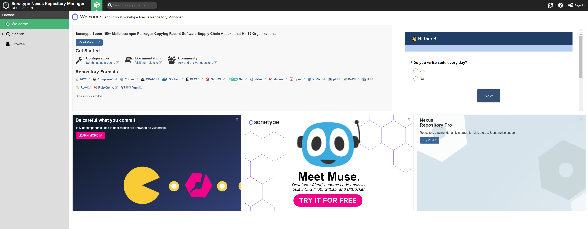

# Private Sonatype Nexus Repository Deployment in Azure Container Instances
This repo contains all of the tools, references and deployment scripts you need to get a private Sonatype Nexus server running on Azure using Container Instances. SSL is provided by using Caddy as a web-server and reverse-proxy to serve out Let's Encrypt certificates. All of this will be backed by Azure File Shares in your storage account.

[Sonatype Nexus Repository Pro](https://www.sonatype.com/products/repository-pro) | [dockerhub](https://hub.docker.com/r/sonatype/nexus3)

[Caddy](https://caddyserver.com/) | [dockerhub](https://hub.docker.com/_/caddy?tab=description)

<ARCHITECTURE DIAGRAM>


## Pre-Requisites

Familiarity with:

- Docker

- YAML

- Azure Container Instances (ACI)

- Azure CLI / Cloud Shell

- Git

  

## Getting Started

All commands below will be done inside the Azure Cloud Shell.

The very first thing we need is to clone this repository.

**Clone the repo and cd into it**

```bash
git clone https://github.com/nelsonic1/aci-sonatype-nexus-deploy.git

cd aci-sonatype-nexus-deploy/
```

### Subscriptions

If your Azure tenant has multiple subscriptions, ensure you are in the correct subscription before proceeding.

**Check current Subscription**

```
az account show --output table
```

**List all subscriptions**

```
az account list --output table
```

**Switch to a different subscription**

```
az account set --subscription "My Subscription"
```

### Environment Variables

First, we'll set some environment variables so we don't need to keep repeating ourselves. Even if you skip some of the steps below because you already have resources you want to use, you should still edit and set these environment variables to the values you want to use.

**Set Environment Variables**

```
export resourceGroupName="nexus-server-rg"
export locationName="eastus"

export storageAccountName="nexus-server$RANDOM"
export storageAccountKey=""

export containerGroupName="nexus-repo-ssl"
```

### Resource Groups

Next, we need a resource group to deploy your Container Group and Storage Account to.

**Create a Resource Group**

```
az group create --name $resourceGroupName --location $locationName
```

**List Resource Groups**

```
az group list
```

### Storage Accounts

Our Caddy and Nexus containers will need some Azure File Shares to hold certificates and Nexus program data. These will all get mounted into their respective containers when we create the Group.

**Create Storage Account**

```
az storage account create \
    --resource-group $resourceGroupName \
    --name $storageAccountName \
    --location $locationName \
    --kind FileStorage \
    --sku Premium_LRS \
    --enable-large-file-share \
    --min-tls-version TLS1_2 \
    --allow-blob-public-access false \
    --output none
```

**Get Storage Account Keys**

Once we create the Storage Account, we need the keys to be able to create File Shares and access them programmatically.

```
export storageAccountKey=$(az storage account keys list \
    --resource-group $resourceGroupName \
    --account-name $storageAccountName \
    --query "[0].value" | tr -d '"')
```

**Create the Needed File Shares**

We're going to create 3 shares. The caddy file shares only need to be 100GB (lowest default available on AFS). The `nexus-data` share needs to be at least 500GB as recommended by the documentation as you potentially will be storing a large amount of data (packages across multiple repositories, docker images, etc.).

- `caddy-certs` will contain any certificates generated by Let's Encrypt so they are persisted and we don't bump into the monthly cap of 50 free certificates.
- `caddy-config` will contain any configuration automatically generated by Caddy on startup. We could also generate a caddy file (see the caddy documentation) and put it here for it to be mounted into the container.
- `nexus-data` will contain all configuration, licenses, cache and packages stored in Nexus Repository. 

```
export share1="caddy-certs" share1sizeGB=100
export share2="caddy-config" share2sizeGB=100
export share3="nexus-data" share3sizeGB=500

az storage share-rm create \
    --resource-group $resourceGroupName \
    --storage-account $storageAccountName \
    --name $share1 \
    --quota $share1sizeGB \
    --enabled-protocols SMB \
    --output none
    
az storage share-rm create \
    --resource-group $resourceGroupName \
    --storage-account $storageAccountName \
    --name $share2 \
    --quota $share2sizeGB \
    --enabled-protocols SMB \
    --output none
    
az storage share-rm create \
    --resource-group $resourceGroupName \
    --storage-account $storageAccountName \
    --name $share3 \
    --quota $share3sizeGB \
    --enabled-protocols SMB \
    --output none\
    --access-tier Premium
```

### Container Group Deployment

First, we will need to update the file `deploy-aci-nexus-repo.yaml`. Azure Cloud Shell has a number of editors built in such as `nano` and `vi` so feel free to use what you're comfortable with. You will need to change a number of things as marked inside the file. Basically anything that says 'your' should be replaced and everything else should remain untouched.

**Edit the Deployment File**

- Container Group Name
  - The section at the top of the deploy script that contains `name: yourContainerGroupName` should be set to something descriptive to refer to to all containers in the deployment like `nexus-caddy` or `nexus-repo-ssl`
- Nexus Server Resources
  - Nexus Repository recommends 4 CPU and 8GB of RAM as per the documentation. However, the deploy template right now is using 2CPU and 8GB RAM. Nexus may complain inside the interface that only 2 CPU's are allocated. If you are noticing performance issues, up the CPU to 3 or 3.5. Keep in mind that the default quotes for Azure Container Instances state that you can have a max of 4 CPU per container group (this is across all containers). If you update it to 3.5, Caddy will need to have a max of 0.5.
- DNS Name Label
  - The dnsNameLabel in the yaml deploy script should be set to a unique identifier that you would like used in your Fully Qualified Domain Name (FQDN).
  - An example: `dnsNameLabel: nexusrepo1234` results in a FQDN of `nexusrepo1234.eastus.azurecontainer.io`
  - This value should also be set when defining your reverse proxy under the caddy container deploy commands.

```
echo $storageAccountName $storageAccountKey
echo $containerGroupName
# copy the values above as we'll use them in the deploy script

nano deploy-aci-nexus-repo.yaml
```

**Create the Container Group**

```
az container create --resource-group $resourceGroupName --file deploy-aci-nexus-repo.yaml
```

**List Container Groups Available**

```
az container list --resource-group $resourceGroupName
```

### Cleanup

**Optional** - Use this to cleanup what you've created if you want to tear everything down.

**Delete the Container Group**

```
az container delete --name $containerGroupName --resource-group $resourceGroupName
```

**Delete the Storage Account**

```
az storage account delete --resource-group $resourceGroupName --name $storageAccountName
```

## 

## Nexus Repository Manager

Now that we have our Container Group up and running in ACI, we can check to see if it the web interface deployed by the Nexus container is live and served out securely using HTTPS.

Open a web browser and enter your Fully Qualified Domain Name (FQDN). This can be found inside the Azure Portal under 'Container Instances > Overview' or with the below command

```
az container show --resource-group $resourceGroupName --name $containerGroupName --query 'ipAddress.fqdn' --output tsv
```

If it is successful, you will see the screen below and you should notice a Lock icon in the address bar if the site is being served out securely. This means that Caddy has gotten valid certificates from Let's Encrypt and you should also be able to see them in the `caddy-certs` File Share.




### Password

Now it's time to login to Nexus Repository Manager. On first start of the container, there is only one account under `admin` and the password for that account is located inside the container. Follow these instructions to retrieve that password. This is a one-time use password and you will be required to change it after logging in.

``` bash
az container exec --resource-group $resourceGroupName --name $containerGroupName --container-name nexus-repo --exec-command "/bin/bash"

# copy the password that is output after this command
cat /nexus-data/admin.password && echo

```

*Note: ACI does not support chaining commands or else we would have done that instead*

### Login

Now that we have the admin password, we can login to the web interface using the `admin` user and password you retrieved.

On the prompt, enter a new password.

Next we want to click `Disable Anonymous Access`. You may enable this option if you're just setting up for a proof of concept or to check out the product. Disabling this option will require that all users and build tools have credentials.


## Configuration

Configuration of Nexus Repository Manager is outside of the scope of this document. Please refer to the official documentation.

[Nexus Repository Manager - Official Documentation](https://help.sonatype.com/repomanager3)


## References

https://docs.microsoft.com/en-gb/azure/container-instances/container-instances-quickstart

https://docs.microsoft.com/en-gb/azure/container-instances/container-instances-multi-container-yaml

https://docs.microsoft.com/en-gb/azure/container-instances/container-instances-volume-azure-files

https://docs.microsoft.com/en-gb/azure/container-instances/container-instances-get-logs

https://docs.microsoft.com/en-gb/azure/container-instances/container-instances-container-group-ssl

https://docs.microsoft.com/en-gb/azure/storage/files/storage-how-to-use-files-cli

https://itnext.io/automatic-https-with-azure-container-instances-aci-4c4c8b03e8c9

https://hub.docker.com/r/sonatype/nexus3

https://hub.docker.com/_/caddy

https://www.antstack.io/blog/how-to-enable-tls-for-hasura-graphql-engine-in-azure-caddy/

https://github.com/antstackio/azure-hasura-caddy-arm-template

https://github.com/nelsonic1/aci-pypi-ssl-deploy

https://docs.microsoft.com/en-us/azure/container-instances/container-instances-reference-yaml

https://caddyserver.com/docs/caddyfile/directives/reverse_proxy

https://docs.docker.com/cloud/aci-integration/

https://help.sonatype.com/repomanager3

